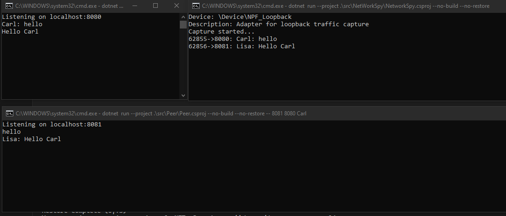

# Network communication POC through CLI

SharpPcap for network spy with npcap drivers installed
PacketDotNet for parsing packets

## POC level 1

Two peers that is both client and server that can communicate through parallell connections with the cli.

## POC level 2

Two peers that can both initiate connection but communicates through one single tcp connection.

## Poc level 3

One connection talking https